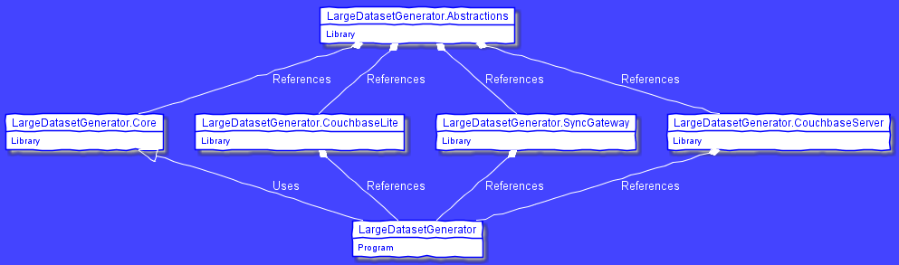

# LargeDatasetGenerator

A .NET Core application designed to generate an arbitrarily large set of JSON data based on a template and write it to a predefined output.  Examples of the output include:

- JSON Files
- Couchbase Lite
- Couchbase Sync Gateway
- Couchbase Server

The input file format is heavily inspired by [JSON Generator](https://next.json-generator.com/) and involves a moustache style of functions written into JSON strings.  The template itself is also valid JSON.

## Usage

```
  LargeDatasetGenerator [options]

  Options:
  -?                      Show help information
  -i|--input <FILE>       The file to read the document template from
  -o|--output <TYPE>      The way to save the resulting JSON
  -c|--count <COUNT>      The number of entries to generate from the template (default 1000)
  -b|--batch-size <SIZE>  The number of entries to process as one unit (default 100)
  --list-output           List the available output methods for writing JSON
  --list-generators       List the available generator functions for the template JSON
  ```

  The output types provided by this repo are as follows:

```
file
    --filename <OUTPUT>

couchbase_lite
    --name <NAME> [--path <PATH>]

couchbase_server
    --url <URL> --username <USER> --password <PASS> --bucket <BUCKET_NAME>

sync_gateway
    --url <URL>
```

## Extension

This application is architected so that all of the logic is contained in a reusable library, combined with plugin functionality.  Here is a diagram of the architecture:



To explain a bit further, the 'LargeDatasetGenerator' program references and uses classes from within 'LargeDatasetGeneratore.Core'.  It also references, but does not directly use, three plugin assemblies that provide output functionality.  If extending the functionality of the core library, you need only reference the 'LargeDatasetGenerator.Abstractions' assembly, built your plugin types, and then reference the plugin assembly from the main program when building.  The core library will take care of the rest.

To learn more about writing custom output types, see [README_output.md](README_output.md).

To learn more about writing custom generator types, see [README_generator.md](README_generator.md)